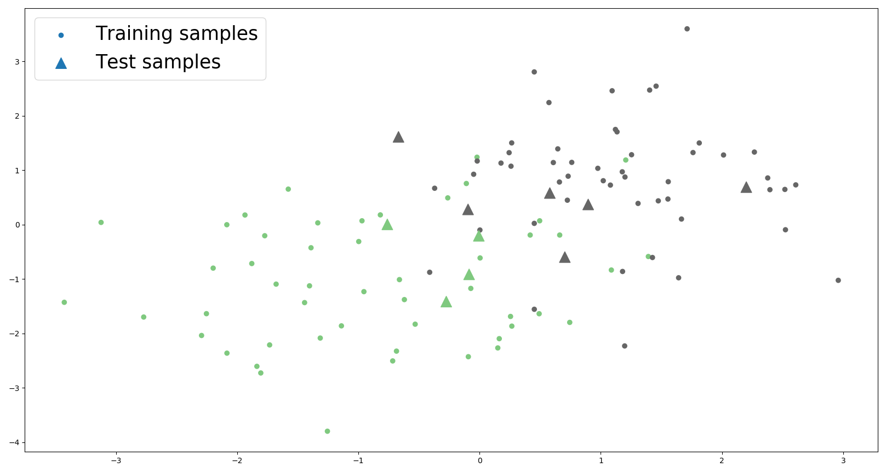

# LDA loss and classifier
Tensorflow &amp; PyTorch implementation of LDA loss. Paper: [Deep Linear Discriminant Analysis](http://arxiv.org/abs/1511.04707)


## Tensorflow V2

The code is tested in `Tensorflow>=2.2`. Support CPU and GPU.

* `./TensorflowV2/loss.py`: LDA loss implementation with auto-backpropagation.
* `./TensorflowV2/classifier.py`: LDA classifier implementation.

### 1. Usage

```python
y = [0, 0, 1, 1]
X = [[1, -2], [-3, 2], [1, 1.4], [-3.5, 1]]
with tf.GradientTape() as tape:
    X = tf.convert_to_tensor(X)
    y = tf.convert_to_tensor(y)
    tape.watch([X, y])
    loss = linear_discriminative_loss(y, X)
grad = tape.gradient(loss, X)
print(loss)
# tf.Tensor(0.17815113, shape=(), dtype=float32)

print(grad)
# tf.Tensor(
# [[ 0.01978466  0.06078595]
#  [ 0.0704403   0.21641952]
#  [-0.02760822 -0.08482301]
#  [-0.06261673 -0.19238248]], shape=(4, 2), dtype=float32)
```

### 2. Training with LDA loss

```python
import tensorflow as tf
from loss import LinearDiscriminativeLoss

loss_obj = LinearDiscriminativeLoss()

with tf.GradientTape() as tape:
    X_train, y_train = model(batch)
    loss = loss_obj(X_train, y_train)
grad = tape.gradient(loss, model.trainable_variables)
optimizer.apply_gradients(zip(grad, model.trainable_variables))
```

### 3. Evaluation with LDA classifier

```python
from metric import LDA

X_train, y_train = model(batch)

lda = LDA().fit(X, y)
# Compute prediction
y_pred = lda.pred(X_test)
# Compute accuration
acc = lda.test(X_test, y_test)
```

## PyTorch

The code is tested in `PyTorch>=1.5`. Support CPU and GPU.

* `./PyTorch/loss.py`: LDA loss implementation with auto-backpropagation.
* `./PyTorch/classifier.py`: LDA classifier implementation.

### 1. Usage

```python
y = torch.from_numpy(np.array([0, 0, 1, 1]))
X = torch.from_numpy(np.array([[1, -2], [-3, 2], [1, 1.4], [-3.5, 1]]))
X.requires_grad = True
loss_obj = LinearDiscriminativeLoss()
loss = loss_obj(X, y)
loss.backward()
print(loss)
# tensor(0.1782, dtype=torch.float64, grad_fn=<NegBackward>)

print(X.grad)
# tensor([[ 0.0198,  0.0608],
#         [ 0.0704,  0.2164],
#         [-0.0276, -0.0848],
#         [-0.0626, -0.1924]], dtype=torch.float64)
```

### 2. Training with LDA loss

```python
import torch.nn as nn
from loss import LinearDiscriminativeLoss

loss_obj = LinearDiscriminativeLoss()

optimizer.zero_grad()
X_train, y_train = model(batch)
loss = loss_obj(X_train, y_train)
loss.backward()
optimizer.step()
```

### 3. Evaluation with LDA classifier

```python
from metric import LDA

X_train, y_train = model(batch)

lda = LDA().fit(X, y)
# Compute prediction
y_pred = lda.pred(X_test)
# Compute accuration
acc = lda.test(X_test, y_test)
```

### 4. Plot

An example of LDA classifier.

```python
import torch
import numpy as np
import matplotlib.pyplot as plt
np.random.seed(123)

X1 = np.random.multivariate_normal(mean=[-1, -1], cov=[[1, 0], [0, 1]], size=50)
X2 = np.random.multivariate_normal(mean=[1, 1], cov=[[1, 0], [0, 1]], size=50)

X = torch.from_numpy(np.concatenate((X1, X2), axis=0))
y = torch.from_numpy(np.concatenate((np.zeros(X1.shape[0]), np.ones(X2.shape[0])), axis=0))
Xt = np.random.multivariate_normal(mean=[0, 0], cov=[[1, 0], [0, 1]], size=10)
yt = LDA().fit(X, y).pred(Xt)

plt.scatter(*X.T, c=y, cmap="Accent")
plt.scatter(*Xt.T, c=yt, marker='^', s=200, cmap="Accent")
plt.legend(["Training samples", "Test samples"], fontsize=25)
plt.show()
```

Plots: Color denotes classes.



## Reference
* Paper: [Deep Linear Discriminant Analysis](http://arxiv.org/abs/1511.04707)
* Theano Implementation: [https://github.com/CPJKU/deep_lda](https://github.com/CPJKU/deep_lda)
